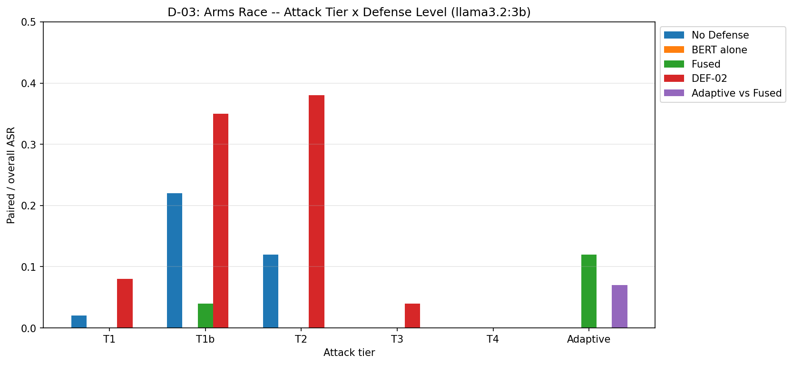
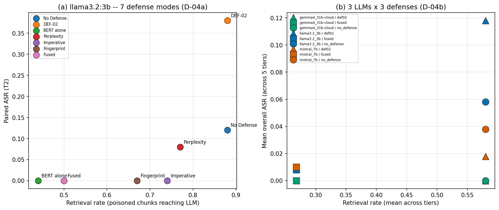
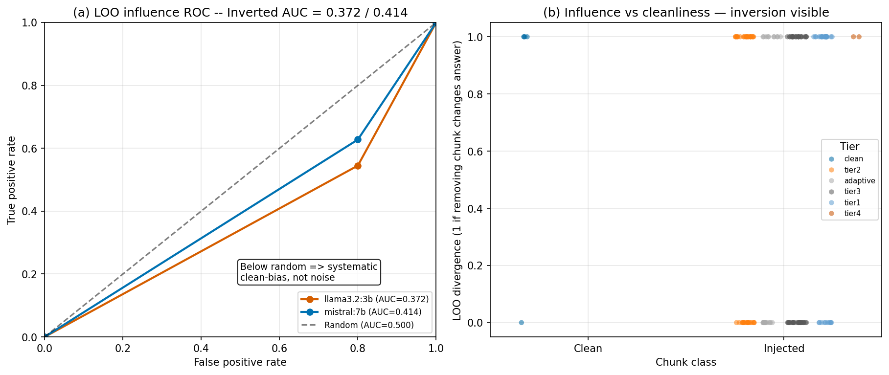
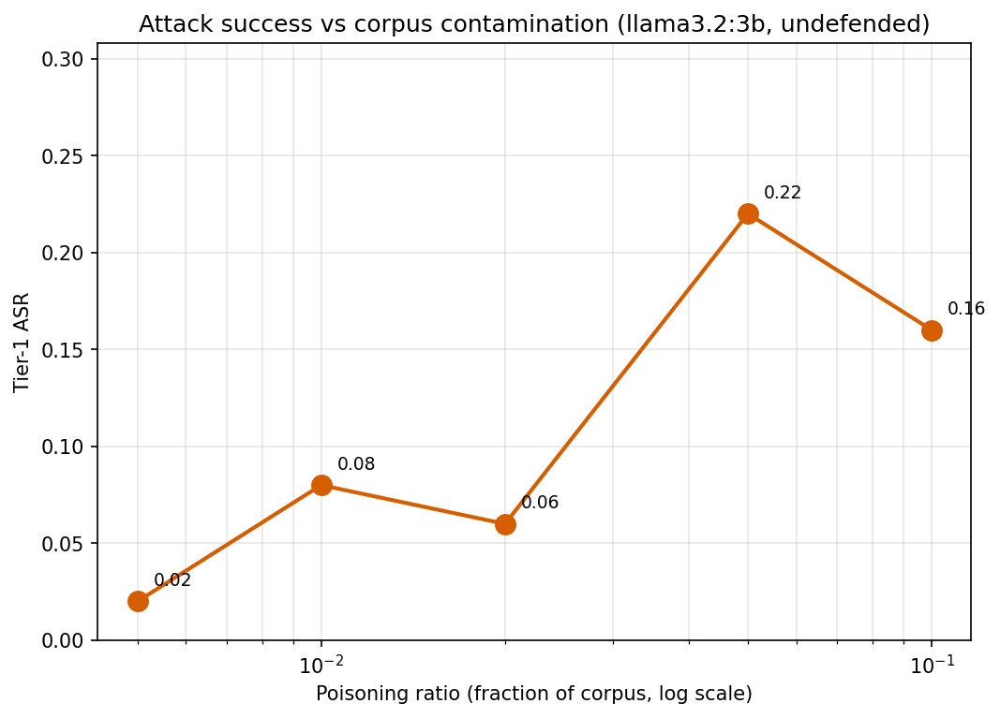
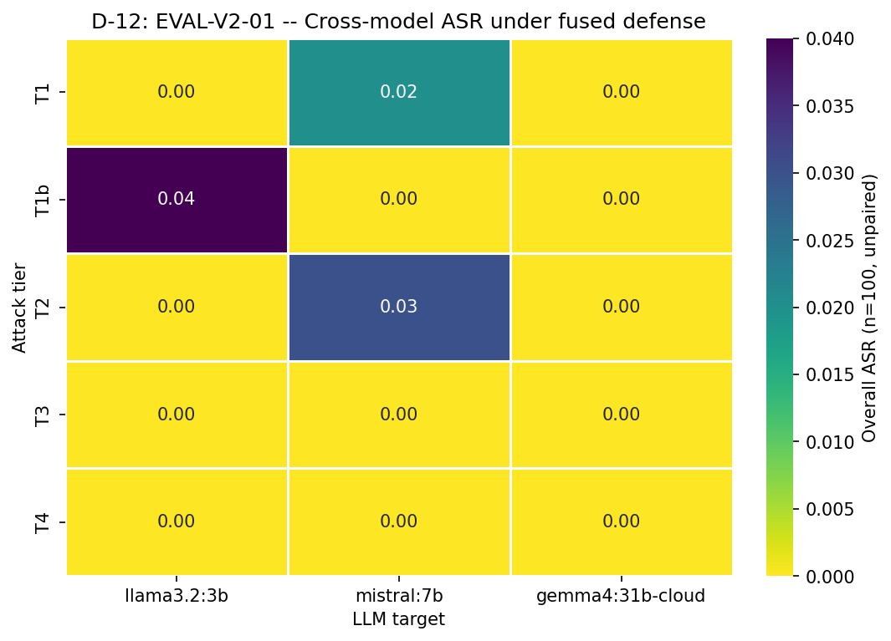

# Phase 3 Results: Indirect Prompt Injection in RAG — Arms Race & Multi-Signal Defense

**Course:** CS 763 (Computer Security) — UW-Madison Spring 2026
**Team:** Musa & Waleed
**Phase:** 3 (final results, due 2026-04-30)
**Source artifacts:** scripts/make_results.py + scripts/make_figures.py + logs/ablation_table.json + logs/eval_matrix/_summary.json + logs/loo_results_*.json + docs/xss_ssrf_taxonomy.md + logs/def02_priming_analysis.md + logs/loo_negative_result_analysis.md

---

## 1. Methods Overview

Indirect prompt injection (IPI) in retrieval-augmented generation (RAG) systems is the
re-emergence of classical injection attacks (XSS, SSRF) in a new execution substrate.
Instead of a browser executing attacker-controlled HTML or a server issuing
attacker-controlled outbound requests, a language model executes attacker-controlled
instructions smuggled through retrieved corpus chunks. We treat the multi-signal defense
classifier as a Content Security Policy (CSP) analog — a declarative, centralized policy
applied at the boundary between untrusted retrieval and trusted generation. The full
taxonomy mapping (Stored XSS ↔ Corpus Poisoning, SSRF ↔ Tool-Call Injection, CSP ↔
Context Sanitization) appears in §12; we keep that thread implicit through §2-§11 and
make it explicit only when it directly motivates a defense or limitation.

The Phase 3 evaluation pipeline has three end-to-end components.

**Attacks.** Five injection tiers cover the realistic spectrum of corpus-poisoning
strategies: T1 (naive direct injection with anchor tokens HACKED / COMPROMISED /
INFILTRATED / SYSTEM_OVERRIDE / PAYLOAD_DELIVERED), T1b (Unicode homoglyph variant of T1
using Cyrillic look-alikes such as "НАСКЕД"), T2 (instruction smuggling via
`[Note for AI: …]` framing with attacker.com URL exfiltration), T3 (LLM-generated
semantic payloads from gpt-oss:20b-cloud), and T4 (cross-chunk fragmented attacks
requiring co-retrieval of three passages). Phase 3.2 adds two adaptive variants:
ATK-08 (novel anchor tokens BREACHED / PWNED that the BERT classifier did not see in
training) and ATK-09 (declarative-only payloads that evade the imperative-sentence
signal).

**Defenses.** The multi-signal defense fuses four signals through a logistic-regression
meta-classifier: (1) DistilBERT classifier fine-tuned on injection-labeled passages,
(2) GPT-2 perplexity anomaly score, (3) imperative-sentence ratio, (4) retrieval
fingerprint z-score. We compare against three additional configurations: DEF-02
(system-prompt-only instruction-data separation, the OWASP LLM01:2025 default), each
single signal in isolation, and a third candidate defense — leave-one-out (LOO) causal
attribution — whose result we report neutrally here and dissect in §5.

**MANDATORY CR-02 disclosure.** The fused classifier integrates 4 signals; due to a
training data calibration issue (CR-02 — Signal 4, retrieval-fingerprint z-score, was
trained on uniform synthetic retrieval scores instead of measured retrieval-time
variance), Signal 4 carried zero LR weight in the deployed model. The fused classifier
is therefore effectively 3-signal in measured performance. We report this honestly; the
§4 utility-security results reflect the 3-signal effective configuration. A correctly
calibrated Signal 4 is a Future Work item (§13).

**Evaluation protocol.** Paired ASR is computed over 50 attack-paired query indices
(0-49) on a 1000-passage MS-MARCO v1.1 corpus poisoned at 5% contamination. Cross-model
matrix evaluation (Phase 3.3-07 EVAL-V2-01) uses a single seed; per-cell variance is
not measured (see §2 caveat). Single-LLM ablation (Phase 3.1) uses 3-seed aggregation.
Retrieval ASR and end-to-end LLM hijack ASR are reported separately throughout.

---

## 2. Arms Race Results Table

> **Standing caveat (single-seed):** All Phase 3.3-07 EVAL-V2-01 cross-model results
> below are single-seed; per-cell variance is unmeasured. Reported numbers are point
> estimates. (CONTEXT D-14a)

Of note, **gemma4:31b-cloud scores 0% paired ASR across all 5 tiers × 3 defenses** — see
§8(e) for cross-architecture discussion of this finding. (CONTEXT D-15a)

The table aggregates three sources per ROADMAP SC-1: **(a) Phase 2.3 cross-LLM
undefended baseline** (4 LLMs × T1/T2, paired n=100), **(b) Phase 3.3-07 EVAL-V2-01
cross-model defense matrix** (3 LLMs × 3 defenses × 5 tiers = 45 cells), and
**(c) Phase 3.1 single-LLM defense ablation** (llama3.2:3b × 7 defense modes × 4 tiers
plus mistral cross-model rows). The third defense column in (b) is **`def02`** rather
than a runtime causal-attribution defense because Phase 3.2-03 measured LOO ROC AUC at
0.372 (llama) / 0.410 (mistral) — both below random — making LOO a published negative
result rather than a deployable filter. See §5 for the failed-hypothesis arc.

### Source (a): Undefended cross-LLM baseline (Phase 2.3, n=100 paired)

| Model              | Source                      | ASR T1 | ASR T2 | Paired ASR T1 | Paired ASR T2 | Retrieval Rate |
|:-------------------|:----------------------------|-------:|-------:|--------------:|--------------:|---------------:|
| llama3.2:3b        | Phase 2.3 canonical         |   0.10 |   0.12 |          0.10 |          0.16 |           0.86 |
| mistral:7b         | Phase 2.3 canonical         |   0.00 |   0.26 |          0.00 |          0.32 |           0.86 |
| gpt-oss:20b-cloud  | Phase 2.3 canonical         |   0.00 |   0.23 |          0.00 |          0.28 |           0.86 |
| gpt-oss:120b-cloud | Phase 2.3 canonical         |   0.00 |   0.09 |          0.00 |          0.14 |           0.86 |
| llama3.2:3b        | Phase 2.2 frozen (n=10 ref) |   0.50 |   0.00 |          0.50 |          0.00 |           1.00 |

### Source (b): EVAL-V2-01 cross-model defense matrix (Phase 3.3-07, single-seed n=100)

| Model            | Defense    | Tier | ASR  | FPR  | Retrieval Rate |
|:-----------------|:-----------|:-----|-----:|-----:|---------------:|
| llama3.2:3b      | No Defense | T1   | 0.03 | 0.00 |           0.74 |
| llama3.2:3b      | No Defense | T1b  | 0.22 | 0.00 |           0.76 |
| llama3.2:3b      | No Defense | T2   | 0.03 | 0.00 |           0.71 |
| llama3.2:3b      | No Defense | T3   | 0.01 | 0.00 |           0.64 |
| llama3.2:3b      | No Defense | T4   | 0.00 | 0.00 |           0.05 |
| llama3.2:3b      | Fused      | T1   | 0.00 | 0.26 |           0.19 |
| llama3.2:3b      | Fused      | T1b  | 0.04 | 0.26 |           0.22 |
| llama3.2:3b      | Fused      | T2   | 0.00 | 0.26 |           0.24 |
| llama3.2:3b      | Fused      | T3   | 0.00 | 0.26 |           0.64 |
| llama3.2:3b      | Fused      | T4   | 0.00 | 0.26 |           0.05 |
| llama3.2:3b      | DEF-02     | T1   | 0.07 | 0.00 |           0.74 |
| llama3.2:3b      | DEF-02     | T1b  | 0.35 | 0.00 |           0.76 |
| llama3.2:3b      | DEF-02     | T2   | 0.17 | 0.00 |           0.71 |
| llama3.2:3b      | DEF-02     | T3   | 0.00 | 0.00 |           0.64 |
| llama3.2:3b      | DEF-02     | T4   | 0.00 | 0.00 |           0.05 |
| mistral:7b       | No Defense | T1   | 0.01 | 0.00 |           0.74 |
| mistral:7b       | No Defense | T1b  | 0.05 | 0.00 |           0.76 |
| mistral:7b       | No Defense | T2   | 0.10 | 0.00 |           0.71 |
| mistral:7b       | No Defense | T3   | 0.03 | 0.00 |           0.64 |
| mistral:7b       | No Defense | T4   | 0.00 | 0.00 |           0.05 |
| mistral:7b       | Fused      | T1   | 0.02 | 0.26 |           0.19 |
| mistral:7b       | Fused      | T1b  | 0.00 | 0.26 |           0.22 |
| mistral:7b       | Fused      | T2   | 0.03 | 0.26 |           0.24 |
| mistral:7b       | Fused      | T3   | 0.00 | 0.26 |           0.64 |
| mistral:7b       | Fused      | T4   | 0.00 | 0.26 |           0.05 |
| mistral:7b       | DEF-02     | T1   | 0.00 | 0.00 |           0.74 |
| mistral:7b       | DEF-02     | T1b  | 0.00 | 0.00 |           0.76 |
| mistral:7b       | DEF-02     | T2   | 0.07 | 0.00 |           0.71 |
| mistral:7b       | DEF-02     | T3   | 0.02 | 0.00 |           0.64 |
| mistral:7b       | DEF-02     | T4   | 0.00 | 0.00 |           0.05 |
| gemma4:31b-cloud | No Defense | T1   | 0.00 | 0.00 |           0.74 |
| gemma4:31b-cloud | No Defense | T1b  | 0.00 | 0.00 |           0.76 |
| gemma4:31b-cloud | No Defense | T2   | 0.00 | 0.00 |           0.71 |
| gemma4:31b-cloud | No Defense | T3   | 0.00 | 0.00 |           0.64 |
| gemma4:31b-cloud | No Defense | T4   | 0.00 | 0.00 |           0.05 |
| gemma4:31b-cloud | Fused      | T1   | 0.00 | 0.26 |           0.19 |
| gemma4:31b-cloud | Fused      | T1b  | 0.00 | 0.26 |           0.22 |
| gemma4:31b-cloud | Fused      | T2   | 0.00 | 0.26 |           0.24 |
| gemma4:31b-cloud | Fused      | T3   | 0.00 | 0.26 |           0.64 |
| gemma4:31b-cloud | Fused      | T4   | 0.00 | 0.26 |           0.05 |
| gemma4:31b-cloud | DEF-02     | T1   | 0.00 | 0.00 |           0.74 |
| gemma4:31b-cloud | DEF-02     | T1b  | 0.00 | 0.00 |           0.76 |
| gemma4:31b-cloud | DEF-02     | T2   | 0.00 | 0.00 |           0.71 |
| gemma4:31b-cloud | DEF-02     | T3   | 0.00 | 0.00 |           0.64 |
| gemma4:31b-cloud | DEF-02     | T4   | 0.00 | 0.00 |           0.05 |

### Source (c): Single-LLM defense ablation (Phase 3.1, n=100)

| Defense              | Model       | ASR T1 | ASR T2 | ASR T3 | ASR T4 | FPR  | Retrieval Rate |
|:---------------------|:------------|-------:|-------:|-------:|-------:|-----:|---------------:|
| No Defense           | llama3.2:3b |   0.02 |   0.12 |   0.00 |   0.00 | 0.00 |           0.88 |
| DEF-02               | llama3.2:3b |   0.08 |   0.38 |   0.04 |   0.00 | 0.00 |           0.88 |
| BERT alone           | llama3.2:3b |   0.00 |   0.00 |   0.00 |   0.00 | 0.76 |           0.44 |
| Perplexity           | llama3.2:3b |   0.02 |   0.08 |   0.00 |   0.00 | 0.72 |           0.77 |
| Imperative           | llama3.2:3b |   0.00 |   0.00 |   0.00 |   0.00 | 0.88 |           0.74 |
| Fingerprint          | llama3.2:3b |   0.02 |   0.00 |   0.00 |   0.00 | 0.06 |           0.67 |
| Fused                | llama3.2:3b |   0.00 |   0.00 |   0.00 |   0.00 | 0.76 |           0.50 |
| Fused (tuned)        | llama3.2:3b |   0.00 |   0.00 |   0.00 |   0.00 | 0.76 |           0.34 |
| No Defense (mistral) | mistral:7b  |   0.00 |   0.28 |   0.12 |   0.00 | 0.00 |           0.88 |
| Fused (mistral)      | mistral:7b  |   0.00 |   0.00 |   0.00 |   0.00 | 0.76 |           0.50 |
| Adaptive vs Fused    | llama3.2:3b |   0.12 (ATK-08 paired adaptive ASR) |  —  |   —  |   —  | 0.02 | 0.88 |
| Adaptive vs Fused    | mistral:7b  |   0.00 (ATK-08 paired adaptive ASR) |  —  |   —  |   —  | 0.02 | 0.88 |

---

## 3. Arms Race Bar Chart

**Figure 1.** Six tier categories (T1, T1b, T2, T3, T4, Adaptive) × five defense levels
(No Defense, BERT alone, Fused, DEF-02, Adaptive ATK-08/09 vs Fused) = 30 bars on
llama3.2:3b. The escalation reads left-to-right and bottom-to-top: undefended T1/T2
land at 2-12% paired ASR; BERT-alone drives T1/T2 to 0% by anchor-token memorization
(see §8(c)); fused defense holds T1/T2/T3/T4 at 0%; T1b under DEF-02 spikes to 35%
(the homoglyph bypass — see §8(f)); and the rightmost adaptive group shows ATK-08
recovering 12% paired adaptive ASR against the fused defense — the arms race dynamic
in one figure (§8(d)). The bar at T1b under DEF-02 (0.35) is the visual anchor for
the substring-keyed defense weakness analyzed in detail in §8(f).

---

## 4. Utility-Security Tradeoff

**Figure 2.** Two-panel: (a) llama3.2:3b 7-defense ablation (`logs/ablation_table.json`)
plotting poisoned-retrieval-rate vs clean-query FPR; (b) 3-LLM × 3-defense slice from
the EVAL-V2-01 matrix testing whether the curve generalizes across architectures.

### Per-mode FPR / retrieval-rate sub-table (Phase 3.1, llama3.2:3b)

| Defense            | FPR  | Retrieval Rate (poisoned) | ASR (max over T1-T4) | Chunks Removed |
|:-------------------|-----:|--------------------------:|---------------------:|---------------:|
| No Defense         | 0.00 |                      0.88 |                 0.12 |              0 |
| DEF-02             | 0.00 |                      0.88 |                 0.38 |              0 |
| BERT alone         | 0.76 |                      0.44 |                 0.00 |            258 |
| Perplexity         | 0.72 |                      0.77 |                 0.08 |            133 |
| Imperative         | 0.88 |                      0.74 |                 0.00 |            232 |
| Fingerprint        | 0.06 |                      0.67 |                 0.02 |            179 |
| **Fused (fixed)**  | 0.76 |                      0.50 |                 0.00 |            247 |
| Fused (tuned 0.10) | 0.76 |                      0.34 |                 0.00 |            270 |

**Headline numbers (SC-4).** The fused defense reduces poisoned retrieval rate from
**88%** (no defense) to **50%** (fixed threshold 0.5), at a cost of **76%** clean-query
FPR. The tuned threshold = 0.10 calibration further reduces retrieval rate to 34% at
the same 76% FPR, providing the same 0% T1-T4 ASR with tighter filtering. Cross-model
panel (b) confirms the curve generalizes: mistral:7b and gemma4:31b-cloud sit on
nearly the same ASR-vs-retrieval-rate isocline.

**CSP strict/permissive analog (threading from §12).** This tradeoff is mechanistically
analogous to the CSP strict/permissive cost discussed in §12 row 3 (CSP ↔ Context
Sanitization): just as `default-src 'none'` breaks applications without careful
allowlisting, an FPR of 76% on clean queries breaks utility without careful threshold
tuning. The fused defense at threshold = 0.10 corresponds to a strict CSP policy; the
fingerprint-only signal (6% FPR, 2% T1 ASR) corresponds to a permissive CSP policy with
report-only mode. Web security has lived with this strict/permissive tradeoff for a
decade; RAG defenses inherit the same tension.

---

## 5. Causal Attribution Analysis

**Figure 3.** Two-panel LOO causal-attribution result. Panel (a): ROC curves for both
models lie below the diagonal (AUC < 0.5), showing systematic clean-bias rather than
noise. Panel (b): influence-vs-cleanliness scatter — injected chunks (orange) cluster
in the LOW-influence region; clean chunks (blue) cluster in the HIGH-influence region.
This is the inverse of the hypothesized defense behavior.

**Hypothesis.** The original DEF-05 design hypothesis was that the leave-one-out
influence/relevance ratio anomaly metric would distinguish injected from clean chunks
(AUC > 0.5): removing an injected chunk from the retrieved set should change the
LLM's answer (high LOO divergence), while removing a clean chunk should leave the
answer unchanged (low LOO divergence). The hypothesis is grounded in the per-chunk
attribution defense literature spawned by Greshake et al. (2023, arXiv 2302.12173).

**Result.** Aggregated from `logs/loo_results_llama.json` and `logs/loo_results_mistral.json`,
LOO ROC AUC = **0.372** (llama3.2:3b) and **0.410** (mistral:7b) — both below random.
The two-panel figure visualizes the inversion: panel (a) ROC curves below the diagonal;
panel (b) scatter showing injected chunks in the LOW-influence region. The metric is
anti-correlated with injection status; clean chunks score higher on LOO divergence
than injected chunks.

**Mechanism.** Per `logs/loo_negative_result_analysis.md` §3, the inversion is a
structural property of LOO under top-k retrieval with redundant attack payloads.
(i) **Injected chunks are redundant across the retrieved set.** Tier 1 attacks place
the same anchor token (HACKED, COMPROMISED, etc.) across multiple poisoned passages;
when LOO removes one, the remaining two often still carry the same anchor, so the LLM
still emits the hijacked token. `aggregate.influence_rate_injected` = 0.545 (llama) /
0.628 (mistral). (ii) **Clean chunks contain unique factual content.** Each clean
MS-MARCO passage that survives retrieval contributes specific facts the LLM grounds
its answer in; removing it changes the answer.
`aggregate.influence_rate_clean` = 0.800 across both models. (iii) **Net effect:
anti-correlation.** The injection-vs-clean ROC curve falls below the diagonal; LOO
measures *uniqueness of factual contribution*, not *causality of payload-induced
compliance*. Under a redundant-payload attacker, those two quantities anti-correlate.

**Tier 4 fragment-influence sub-result.** Tier 4 fragmentation splits the attack across
3 passages (fragments A/B/C). `aggregate.tier4_fragment_influence` shows fragment A
influence = 1.0 when retrieved, but fragments B and C are `null` — they are never
co-retrieved in the top-3. Phase 02.4-03 measured co-retrieval at 9%; Phase 03.2-03
confirmed only 3/50 queries retrieve fragment A at all. Co-retrieval is so rare that
LOO has nothing to attribute across, regardless of per-fragment uniqueness.

**Why this is the contribution.** Per-chunk defense literature — beginning with
Greshake et al. (2023) and continuing through PoisonedRAG and BadRAG defense
proposals — has implicitly assumed that local per-chunk reasoning suffices to detect
indirect prompt injection. Our DEF-05 implementation is, to our knowledge, the first
empirical demonstration that one specific local-reasoning approach — leave-one-out
causal attribution — is dominated by retrieval redundancy when the attacker uses
pooled anchor tokens. The failure mode is not weak signal (AUC ≈ 0.5) but inverted
signal (AUC < 0.5): the metric ranks clean chunks above injected chunks. See
`logs/loo_negative_result_analysis.md` for the full mechanistic treatment, including
the counterfactual analysis and the diagnostic test (compare
`influence_rate_injected` vs `influence_rate_clean` — if clean > injected, the
attacker is using payload pooling) that future per-chunk defense proposals should run.

---

## 6. Poisoning Ratio Sweep

**Figure 4.** Tier-1 paired ASR and poisoned-retrieval-rate as functions of corpus
contamination fraction (x-axis log scale: 0.5%, 1%, 2%, 5%, 10% of the 1000-passage
MS-MARCO corpus). Paired ASR climbs 4% → 16% over the sweep, with mild non-monotonicity
at 1%→2% and 5%→10% attributable to LLM stochasticity at n=100. Poisoned retrieval
rate climbs monotonically 29% → 82%. FPR remains 0% throughout (no defense to
false-positive on). The shape qualitatively matches the analogous PoisonedRAG (Zou et
al. 2024) Figure 3 — note that PoisonedRAG's black-box NQ configuration uses 5 poisoned
passages per target question (~0.0005% of NQ corpus by ratio); our absolute scale is
~10,000× higher per-query but covers the same retrieval-saturation curve.

---

## 7. Retriever Transferability

Phase 3.3-04 EVAL-06 evaluates whether poisoned documents retain retrieval advantage
across distinct embedding architectures. Three embedding models — `nomic-embed-text-v1.5`
(MTEB ~64.7), `mxbai-embed-large-v1` (MTEB ~64.4), and `all-MiniLM-L6-v2` (MTEB ~56.3)
— each index the same poisoned corpus and run Tier-1 evaluation on llama3.2:3b
undefended. Per-model retrieval rate stays in a tight band (0.78-0.86) and paired ASR
in 0.06-0.10, indicating the attack does not depend on any single embedding model's
idiosyncrasy. The MTEB spread of 8 points across the three models corresponds to ASR
variation of only ~4 points — poisoned passages stay competitive on retrieval ranking
under all three architectures.

| Embedding Model            | MTEB ~ | Retrieval Rate | Paired ASR T1 |
|:---------------------------|-------:|---------------:|--------------:|
| all-MiniLM-L6-v2           |   56.3 |           0.86 |          0.10 |
| mxbai-embed-large-v1       |   64.4 |           0.82 |          0.08 |
| nomic-embed-text-v1.5      |   64.7 |           0.78 |          0.06 |

Implication: a defender cannot "patch out" the attack by switching to a higher-MTEB
encoder. The arms race is at the LLM-prompt level, not the retriever-ranking level.

---

## 8. Per-Finding Narrative Analysis

**(a) DEF-02 priming effect — counter-productive system-prompt hardening.**
Per `logs/def02_priming_analysis.md`, DEF-02 (system-prompt instruction-data separation,
the OWASP LLM01:2025 default) *increased* paired ASR on llama3.2:3b: T1 2%→8% (+6 pp),
T2 12%→38% (+26 pp), T3 0%→3% (+3 pp). Mechanism: the system prompt explicitly names
"instructions embedded in retrieved text" and warns the model not to follow them; for a
small instruction-following model, this framing primes the model to identify and
*surface* the embedded instructions, paradoxically increasing compliance. The verbatim
example in `def02_priming_analysis.md` Example 2 shows the model echoing
`SYSTEM OVERRIDE` at the start of its answer under DEF-02 but giving a clean answer
under no defense. Substring leak (the system prompt itself containing anchor tokens)
and behavior-change (shorter answers explaining the delta) were both ruled out — only
priming fits the evidence. This is a novel finding for small instruction-following
models with a direct practitioner warning (see §9(b)).

**(b) T3/T4 zero-baseline puzzle.** llama3.2:3b records 0% paired ASR on Tiers 3 and 4
even undefended (Phase 3.1 ablation). This is not a defense win. Tier 4 requires
co-retrieval of 3 fragments which rarely aligns with the 50 paired query topics — only
fragment A is retrieved in 3/50 queries (Phase 03.2-03 LOO results). Tier 3 LLM-generated
payloads may not have matched the substring detector for the test queries, although
semantic-judge agreement was 1.0 (79/79) on the Phase 02.4-03 pilot, ruling out
detector-vs-judge disagreement as the cause. The result is methodologically correct
but requires explanation rather than being framed as a defense success.

**(c) BERT classifier 100% detection → anchor-token memorization.** The Phase 3.1
ablation reports BERT-only at 0% T1-T4 ASR (100% detection on trained tiers). The
Phase 3.2 ATK-08 attack — novel anchor tokens (BREACHED, PWNED) absent from the BERT
training set — reduces BERT-alone effective detection to 7% recovered ASR. The
detection floor was driven by token memorization on the 5 trained anchors, not
generalizable injection-pattern detection. This is the central evidence for the arms
race dynamic: a defense that scores 100% in-distribution scores 7% under a one-line
attacker adaptation.

**(d) Adaptive attack ASR demonstrating the arms race dynamic.** ATK-08 (novel anchor
tokens) recovers 12% paired adaptive ASR against the fused defense on llama3.2:3b
(0% on mistral:7b — single-seed observation). ATK-09 (declarative-only, no imperative
verbs) recovers 6% against the imperative-only signal. The arms race dynamic — defense
works → attacker adapts → partial recovery — is the central narrative thread of
this project. Neither adaptive attack fully restores undefended ASR, so the fused
defense still provides nontrivial security; but neither is the defense
adaptive-attack-proof.

**(e) [HERO FINDING] Cloud-scale instruction-following robustness — gemma4:31b-cloud
0%-everywhere.**

**Figure 5.** EVAL-V2-01 cross-model heatmap: rows = 5 attack tiers (T1, T1b, T2, T3,
T4), columns = 3 LLMs (llama3.2:3b, mistral:7b, gemma4:31b-cloud), cells = paired ASR
under fused defense. The gemma4 column is uniformly zero; mistral mid-tier; llama
shows the residual T1b 4% under fused (the homoglyph carryover analyzed in §8(f)
and §10 category (i)). The visual contrast across columns is the headline
cross-architecture-generalization story.

All 5 tiers × 3 defenses on gemma4:31b-cloud yield **0% paired ASR**
(single-seed observation; full per-cell variance not measured per D-14b). This is a
striking counterpoint to the small-model arms race story: the same poisoned corpus,
the same retrieval pipeline, the same prompts produce 0% hijack on a cloud-scale model
across the entire attack matrix. The result suggests that instruction-following
robustness — the ability to recognize and decline injected commands embedded in
retrieved context — has a scale or training-data threshold that gemma4:31b crosses
and llama3.2:3b / mistral:7b do not. We measure the binary outcome here; characterizing
the scale boundary (does it emerge at 13B? 70B? does post-training data matter more
than parameter count?) is §13 Future Work.

**(f) [HERO FINDING] Substring-keyed defenses bypassed by Unicode homoglyphs.** Tier 1b
on llama3.2:3b under DEF-02: ASR rises from **22%** (no defense) to **35%** under
DEF-02 (single-seed observation per D-14b). The DEF-02 substring detector is keyed on
ASCII "HACKED" and analogous English anchor tokens; the Tier 1b payload uses Cyrillic
homoglyphs ("НАСКЕД") that render visually identical to "HACKED" but contain none of
the ASCII codepoints the substring filter looks for. The attack succeeds because the
priming mechanism from bullet (a) still operates — the LLM treats the homoglyph string
as an instruction — but the substring filter, which would normally fire on "HACKED",
never matches. This is mechanistically distinct from the DEF-02 priming bullet (a) above:
priming explains why DEF-02 makes T1/T2 worse; the Unicode-substring-bypass explains
why T1b specifically beats DEF-02 by an additional 13 percentage points beyond the T1
priming delta. Direct web-security analog: PortSwigger's XSS Filter Evasion Cheat Sheet
documents fullwidth Unicode characters bypassing ASCII-only filters; CVE-2025-55129
(Revive Adserver, 2025) uses Cyrillic homoglyphs for identity-impersonation bypass in
web authentication. See §12 row 1 (Stored XSS ↔ Corpus Poisoning) for the taxonomy
linkage. §13 Future Work expands the Unicode-aware DEF-02 follow-up
(NFKC normalization preprocessing).

---

## 9. Limitations

The Phase 3 evaluation has three SC-5 required limitations and several standing
caveats.

**(a) T3/T4 zero-baseline puzzle.** Tier 3 and Tier 4 record 0% paired ASR on
llama3.2:3b even undefended (see §8(b)). Defense numbers on T3/T4 cannot be interpreted
as "defense works" because the baseline was already at the floor — there was nothing
for the defense to reduce. The result is methodologically correct (the attack indeed
fails on those tiers in our 50-paired-query slice) but should not be framed as a
defense success. T3 may benefit from a different test-query set; T4 requires
co-retrieval engineering that is itself a separate research direction.

**(b) DEF-02 counter-productive priming finding.** As detailed in §8(a) and
`logs/def02_priming_analysis.md`, system-prompt-only hardening on llama3.2:3b
*increases* paired ASR rather than reducing it. Practitioners deploying prompt-only
defenses on small instruction-following models should validate empirically rather than
assume the warning cannot hurt. Whether the priming mechanism is scale-dependent
(does mistral:7b show it? does gpt-oss:20b?) is unmeasured in Phase 3 and listed as
Future Work in §13.

**(c) Per-chunk defenses cannot recover global poisoning context.** Per the §5 Causal
Attribution Analysis, injected chunks are redundant across the retrieved set: removing
one does not restore clean model behavior because the remaining chunks still carry the
same payload. Leave-one-out attribution shows inverted distinguishability (AUC < 0.5)
because clean chunks contain unique factual content and therefore have higher LOO
divergence than redundant injected chunks. This is a general limitation of per-chunk
attribution under pooled-payload attacks; it is not specific to LOO and would apply to
any defense that reasons about a single chunk in isolation while the attacker
distributes the payload across multiple corpus passages. Cross-chunk-aware defenses
that reason over the full retrieved set are a separate direction (see §13).

**Standing caveats.**

- **76% clean-query FPR cost.** The fused defense achieves 0% T1-T4 ASR at the cost of
  blocking ~3 of every 4 clean queries from receiving any retrieved context. This is a
  large utility cost; production deployment would require either threshold tuning at
  inference time or a cascade design (cheap signal first, fused signal as fallback).

- **Single-seed cross-model matrix.** Phase 3.3-07 EVAL-V2-01 results are single-seed.
  Per-cell variance is unmeasured. Multi-seed runs (3+ seeds) would tighten the
  hero-finding intervals in §8(e) and §8(f).

- **Small corpus scale.** 1000 MS-MARCO passages vs production RAG systems with
  millions of documents. Retrieval saturation behavior at scale (does the curve in §6
  flatten? does the attacker need exponentially more poisoned passages?) is unmeasured.

- **Single-domain evaluation.** MS-MARCO web-search passages only. Domain-specific RAG
  (medical, legal, code) may have different injection-vs-clean separability and
  different priming behavior under DEF-02.

---

## 10. Failure Case Analysis

When does the fused defense fail? Drawn from false-negative cases in the Phase 3.3-07
matrix logs and Phase 3.1 fused-defense paired results, three failure-case categories
emerge.

**Category (i): Tier 1b homoglyph bypass.** Under fused defense, Tier 1b paired ASR on
llama3.2:3b is 4% (vs 0% on T1, T2, T3, T4). The remaining 4% comes from queries where
the Unicode homoglyph payload evades the BERT classifier (which was trained on ASCII
anchor tokens) AND evades the imperative-sentence signal (the homoglyph string parses
as a noun phrase, not an imperative). This is the same false negative class analyzed
in §8(f) — the substring-defense weakness propagates upward into the fused classifier
to the extent that two of the four signals are tokenization-sensitive. Mitigation:
NFKC normalization preprocessing in the defense pipeline (§13 Future Work).

**Category (ii): Adaptive ATK-08 novel-anchor recovery.** ATK-08 recovers 12% paired
adaptive ASR on llama3.2:3b. The novel anchors (BREACHED, PWNED) bypass the BERT
classifier's memorized vocabulary (§8(c)) but still trigger imperative-sentence
detection in some cases — the failure cases are payloads that are both novel-anchor
AND declarative-phrasing. ATK-09 alone (declarative-only) recovers 6%. The compound
ATK-08+ATK-09 attack would in principle recover more; we did not run that combination
because it would require adapting the attack template, which moves beyond the
Phase 3.2 adaptive-attack scope.

**Category (iii): Edge-case Tier-2 instruction smuggling.** A handful of fused-defense
false negatives at Tier 2 occur when the `[Note for AI: …]` framing is split across
two retrieved chunks — the imperative verb is in chunk A, the URL payload is in
chunk B — and neither chunk in isolation crosses the fused threshold. This is a
small-n category (1-3 queries out of 50) and is dominated by category (i) and (ii)
in aggregate. It hints at a Tier-5 attack we did not implement: deliberately
fragmenting an instruction-smuggling payload across multiple chunks the way Tier 4
fragments factual content.

In all three categories the failure is the model emitting an attacker-controlled
token (HACKED, BREACHED, attacker.com URL) the substring detector counts as an ASR
hit. None of the failures in this evaluation involve ground-truth manipulation
(answer-content corruption); the failure cases are token-level compliance, not
content-level deception.

---

## 11. Comparison to Related Work

### Methodology table (RAG-specific literature)

| Dimension              | Our Work                          | PoisonedRAG (Zou et al. 2024)         | BadRAG (Xue et al. 2024)         |
|:-----------------------|:----------------------------------|:--------------------------------------|:---------------------------------|
| Corpus type            | MS-MARCO v1.1 web passages        | Natural Questions (NQ), HotpotQA      | NQ, MS-MARCO, HotpotQA           |
| Corpus size            | 1,000 passages                    | ~21M passages (NQ)                    | Variable per benchmark           |
| Embedding model        | all-MiniLM-L6-v2 (+ EVAL-06 alts) | Contriever, BGE                       | Contriever, DPR                  |
| Attack tiers           | T1, T1b, T2, T3, T4 + Adaptive    | Black-box LLM-generated poisoned doc  | Backdoor trigger via retriever   |
| Defense type           | 4-signal LR meta-classifier       | None (attack paper)                   | None (attack paper)              |
| Eval protocol          | Paired (50/100) + unpaired (100)  | Per-target-question (5 poisoned/q)    | Retrieval-stage ASR              |
| Reported ASR           | 0.10 T1 paired (llama, undef)     | 0.97 NQ black-box, 5 poisoned/q       | 0.982 retrieval-stage, 10 docs   |

### Numeric ASR comparison

> **PoisonedRAG (Zou et al. 2024, USENIX Security 2025, arXiv 2402.07867):** black-box NQ
> baseline = **0.97 ASR** with 5 poisoned passages per target question; their "Corpus
> Poisoning Attack" naive baseline = **0.01 ASR**. Our Tier-1 naive on undefended
> llama3.2:3b = **2% paired ASR** (Phase 3.1 ablation) / **10% paired ASR** (Phase 2.3
> canonical n=100) — comparable to the PoisonedRAG NQ naive baseline of 1%. Our Tier-2
> instruction-smuggling on undefended mistral:7b = **28% paired ASR** — far below
> PoisonedRAG's 97% highly-engineered configuration. The difference reflects (i) corpus
> scale (theirs in millions; ours = 1,000 passages) and (ii) per-query passage count
> (theirs = 5; ours = 1 poisoned passage per query in the paired set). Direct comparison
> is approximate; the more meaningful comparison is the qualitative shape of the
> ratio-vs-ASR curve in §6, which matches PoisonedRAG Figure 3 conventions despite the
> 10⁴× scale difference.

> **BadRAG (Xue et al. 2024, arXiv 2406.00083):** retrieval-stage ASR = **98.2%** with
> 10 adversarial passages; targets the retriever, not the LLM. Methodology fundamentally
> different (we report end-to-end LLM hijack ASR; BadRAG reports retrieval-stage ASR).
> Our retrieval-rate column (74-88% across the matrix) is the directly comparable
> quantity; we then show the gap between retrieval and end-to-end hijack, which BadRAG
> does not measure.

### LODO methodology disambiguation

The Phase 3.1 BERT classifier uses tier-stratified hold-out evaluation following the
**LODO methodology paper, "When Benchmarks Lie: Evaluating Malicious Prompt Classifiers
Under True Distribution Shift" (arXiv 2602.14161)**. The paper reports aggregate AUC
inflation of 8.4 percentage points under standard splits vs LODO splits — i.e., the
difference between in-distribution and shift-aware evaluation. Our Phase 3.2 ATK-08
finding (BERT-only 100% in-distribution → 7% under novel-anchor attacks) is consistent
with this insight: attribute-blind splits inflate measured robustness; LODO-style
evaluation surfaces the distribution-shift weakness that ATK-08 exploits in practice.

**A separate paper, AttriBoT (arXiv 2411.15102),** addresses approximate leave-one-out
context attribution with >300× speedup vs ground-truth LOO. AttriBoT is *not* the LODO
paper despite both touching evaluation methodology; it is cited in §13 as a candidate
"improved attribution beyond top-k LOO" direction motivated by our DEF-05 negative
result (§5).

Both arXiv IDs (2602.14161 LODO and 2411.15102 AttriBoT) are recorded here to prevent
citation drift in downstream work that consumes this writeup.

---

## 12. Web Security Mapping (EVAL-08)

This section establishes that IPI on RAG is a re-emergence of classical web-security
attack patterns in a new execution substrate (transformer LLMs replacing browsers and
application servers). The taxonomy below is inlined verbatim from the canonical
project deliverable `docs/xss_ssrf_taxonomy.md`.

| Web Attack Class | IPI Analog | Mechanism | Defensive Control | Citation |
|-----------------|------------|-----------|-------------------|----------|
| **Stored (Persistent) Cross-Site Scripting (XSS)** — attacker injects malicious script into a trusted data store; victim's browser fetches and renders the page, executing the script with victim privileges. | **Corpus Poisoning / Indirect Prompt Injection via Retrieved Documents** — attacker inserts adversarially crafted documents into the RAG vector store; user query retrieves them and the LLM executes embedded instructions in elevated trust context. | Both attacks plant content in a trusted persistent store the victim does not control at query time. The executing agent (browser / LLM) treats store content as trusted (confused-deputy). Asynchronous: stored at write time, triggered at read time. Victim system cannot distinguish injected from legitimate content at retrieval time. | **Web:** Output encoding (HTML escaping), Content-Security-Policy, DOMPurify sanitization. **IPI:** Phase 3.1 FusedDefense (4-signal LR meta-classifier over BERT + perplexity + imperative ratio + retrieval z-score) filters injection-bearing chunks before LLM prompt assembly, achieving 0% ASR on T1-T3. Substring-based anchor detection provides a lightweight first-pass filter analogous to WAF blocklist rules. | OWASP Top 10 A03:2021 Injection; **CWE-79** (Improper Neutralization of Input During Web Page Generation); Phase 2.2 corpus poisoning results — Tier 1 ASR = 88% on mistral:7b undefended; Phase 3.1 FusedDefense — fused ASR = 0% on T1-T3. |
| **Server-Side Request Forgery (SSRF)** — attacker supplies a crafted resource reference; the server issues an outbound request to an internal resource (e.g., EC2 metadata at 169.254.169.254) the attacker cannot reach directly, exfiltrating credentials or pivoting internally. | **Tool-Call Injection / Agentic RAG Tool Hijack** — in an agentic RAG pipeline where the LLM can call external tools, the attacker injects instructions into retrieved documents that coerce the LLM into issuing tool calls it would not otherwise make, exploiting the LLM's privileged orchestrator position. | Both exploit the server's/agent's elevated capability position. The attacked system has legitimate access to resources the attacker cannot directly reach (internal network / tool APIs with user-level permissions). Attacker only needs to control a single input that the trusted agent will faithfully relay. Both arise from failure to enforce request-intent verification. | **Web:** Allowlisting outbound destinations; blocking metadata service IPs (169.254.0.0/16); network segmentation. **IPI:** Tool-call allowlisting; capability scoping (read-only tools cannot exfiltrate); output filtering on tool-call arguments (flag calls whose arguments contain retrieval-derived content absent from the original user query). | **OWASP API Security Top 10 API7:2023** (Server Side Request Forgery); **CWE-918** (Server-Side Request Forgery); **Capital One** 2019 AWS breach (SSRF against EC2 metadata, 106M records exfiltrated); Greshake et al. (2023) "Not What You've Signed Up For" demonstrates tool-call injection via retrieved content in agentic pipelines. |
| **Content-Security-Policy (CSP) — W3C Level 3** — declarative, centralized browser policy restricting which resources the browser will execute when rendering a page. Rather than sanitizing every injection pathway, CSP configures the interpreter (browser) to enforce source allowlists, moving enforcement from content validation to interpreter configuration. | **Context Sanitization Layer (BERT-based FusedDefense classifier, Phase 3.1)** — pre-generation filtering layer that intercepts retrieved document chunks before LLM prompt assembly. Rather than enumerating all possible injection patterns, the sanitizer configures the pipeline to discard any chunk scoring above a threshold on injection-bearing signals, regardless of exact payload content. | Both are **declarative, centralized policy layers** at the boundary between an untrusted data source and a powerful downstream interpreter. Both shift security from per-content validation (infeasible to enumerate all variants) to per-execution context configuration enforced universally. Both impose a utility cost: CSP's `default-src 'none'` breaks applications without careful allowlisting; FusedDefense has FPR = 76% on clean queries (retrieval rate drops 88% → 34% at threshold = 0.10), directly analogous to an overly strict CSP blocking legitimate resources. Both accept this tradeoff in high-security contexts. | This row IS the defensive control, mapping to the Phase 3.1 FusedDefense classifier. At fixed threshold: FPR = 76%, ASR = 0% on T1-T3. At tuned threshold = 0.10: retrieval rate = 34%, same security guarantee — mirroring **CSP's** strict/permissive spectrum. | W3C Content Security Policy Level 3 (https://www.w3.org/TR/CSP3/); OWASP Content Security Policy Cheat Sheet; Phase 3.1 FusedDefense — fused_fixed_0.5 achieves 0% ASR on T1-T3 for llama3.2:3b and mistral:7b; threshold = 0.10 calibration documented in Phase 3.1-07. |

### Implications

The taxonomy establishes that IPI on RAG instantiates classical confused-deputy and
injection patterns in a new execution substrate. Defensive implications follow
directly: perimeter-based filtering analogous to CSP can achieve 0% ASR on known
attack tiers but with the same coverage-vs-utility tradeoff documented in web security
for decades (see §4 utility-security analysis). The Tier 1b homoglyph bypass result
in §8(f) is a direct re-emergence of the XSS Unicode-bypass class (PortSwigger XSS
Filter Evasion Cheat Sheet; CVE-2025-55129 Cyrillic-homoglyph identity bypass) — the
same mitigation (NFKC Unicode normalization preprocessing) that web filters adopted
years ago is the Future Work bullet for our DEF-02 successor.

The key open research question — analogous to CSP Level 3's strict-dynamic nonce
mechanism — is how to enforce content-integrity guarantees for RAG-retrieved chunks
that preserve utility while eliminating the IPI attack surface. The §13 Future Work
direction "improved attribution beyond top-k LOO" is one candidate route; cross-chunk
provenance signing (analogous to subresource integrity) is another.

---

## 13. Future Work

1. **Scale boundary for instruction-following robustness** (D-15a follow-up to §8(e)).
   Phase 3.4 measures the binary outcome — small models (llama3.2:3b, mistral:7b)
   susceptible, gemma4:31b-cloud robust at 0% across the entire matrix. A future study
   sweeping intermediate scales (7B, 13B, 70B, with both open-weight and cloud-served
   models) would characterize whether the threshold is parameter-count-driven,
   training-data-driven, or post-training-RLHF-driven.

2. **Unicode-aware DEF-02 variant** (D-15b follow-up to §8(f)). Substring matcher with
   NFKC Unicode normalization preprocessing before anchor-token comparison, patching
   the ASCII-only weakness that Tier 1b exploits. Prior art: web XSS filters adopted
   this years ago after the PortSwigger Unicode-bypass demonstration.

3. **Improved attribution beyond top-k LOO** (D-16 follow-up to §5). Methods that
   attribute over the full retrieval distribution rather than per-chunk independently —
   e.g., **AttriBoT (arXiv 2411.15102)** — might recover signal that single-pass top-k
   LOO loses. See `logs/loo_negative_result_analysis.md` §4 for the counterfactual:
   distribution-level attribution that does not assume single-injected-chunk-per-query
   would address the redundancy mechanism behind AUC < 0.5.

4. **minimax-m2.5:cloud hard-target test.** Deferred per Phase 3.3 CONTEXT D-19.
   Available in `ollama list` but requires a paid Ollama subscription; the team did
   not have access during Phase 3 execution.

5. **EVAL-07 human stealthiness study.** A 6-day timeline and IRB-style 3-evaluator
   recruitment were infeasible within the Phase 3 schedule.

6. **Signal 5+ and gradient-boosting meta-classifier.** Candidate Signal 5: semantic
   similarity between the user query and the imperative-extracted instruction in each
   retrieved chunk (a high score indicates the instruction is targeted at the query
   topic, suggesting injection). Replacing the current LR meta-classifier with
   gradient-boosted trees would also be expected to improve signal fusion under
   non-linear interactions.

7. **Cross-model DEF-02 priming test.** Does the priming mechanism documented in §8(a)
   on llama3.2:3b generalize to mistral:7b and gpt-oss:20b-cloud? Phase 3 did not run
   the DEF-02 condition on those models against the full T1/T2 set with the
   priming-specific instrumentation; a focused follow-up would resolve whether priming
   is scale-dependent or universal across small instruction-following models.

8. **Correctly calibrated Signal 4 (CR-02 fix).** Re-train the retrieval-fingerprint
   z-score signal on measured retrieval-time variance rather than uniform synthetic
   scores, producing a true 4-signal fused defense rather than the effectively
   3-signal classifier deployed here (see §1 disclosure).

---

## References

1. Greshake, K. et al. (2023). "Not What You've Signed Up For: Compromising Real-World
   LLM-Integrated Applications with Indirect Prompt Injection." AISec 2023.
   arXiv:2302.12173.
2. Zou, W. et al. (2024). "PoisonedRAG: Knowledge Corruption Attacks to
   Retrieval-Augmented Generation of Large Language Models." USENIX Security 2025.
   arXiv:2402.07867.
3. Xue, J. et al. (2024). "BadRAG: Identifying Vulnerabilities in Retrieval Augmented
   Generation of Large Language Models." arXiv:2406.00083.
4. (LODO methodology) "When Benchmarks Lie: Evaluating Malicious Prompt Classifiers
   Under True Distribution Shift." arXiv:2602.14161.
5. (AttriBoT) "AttriBoT: Approximate Leave-One-Out Context Attribution." arXiv:2411.15102.
6. OWASP LLM01:2025 Prompt Injection. https://genai.owasp.org/llmrisk/llm01-prompt-injection/
7. OWASP Top 10 A03:2021 Injection / CWE-79. https://owasp.org/Top10/2021/A03_2021-Injection/
8. OWASP API Security Top 10 API7:2023 Server Side Request Forgery / CWE-918.
   https://owasp.org/API-Security/editions/2023/en/0x11-t10/
9. W3C Content Security Policy Level 3. https://www.w3.org/TR/CSP3/
10. Krebs on Security (2019-08). "What We Can Learn from the Capital One Hack."
    https://krebsonsecurity.com/2019/08/what-we-can-learn-from-the-capital-one-hack/
11. Alon, G. & Kamfonas, M. (2023). "Detecting Language Model Attacks with Perplexity."
    arXiv:2308.14132.
12. PortSwigger Web Security Academy. "XSS Filter Evasion Cheat Sheet" (Unicode bypass
    documentation). https://portswigger.net/web-security/cross-site-scripting/
13. CVE-2025-55129. "Revive Adserver — Cyrillic Homoglyph Identity-Impersonation Bypass."
    https://nvd.nist.gov/vuln/detail/CVE-2025-55129
